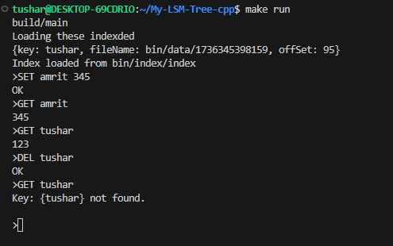

# Yet-Another-LSM-Tree
Reinventing the wheel to understand details
* Implemented a Log-Structured Merge Tree (LSM Tree) Key-Value Storage Engine in C++
## About
* Lightning-fast writes by appending data directly to a binary file, optimizing write performance.
* Reads are highly efficient, leveraging an in-memory index to store byte offsets of the latest records in the data file. 
* It is fault-tolerant, persisting both data and index to the file system.
* Data is stored across multiple immutable files + one active/mutable file for handling large data. 
## How to Run
```
make clean
make run
```
## How to Use 
* Use GET SET DEL EXIT Command as shown:

## References
* https://riak.com/assets/bitcask-intro.pdf
